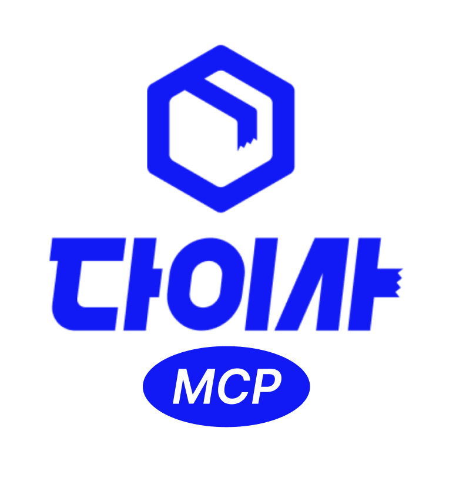

<div align="center">

<a href="https://da24.co.kr"></a>
<br>

## [다이사 MCP Server](https://da24.co.kr)

AI 에이전트에서 이사 견적 계산과 접수를 바로 처리할 수 있는 MCP 서버입니다.

<br>

[](https://www.python.org/)
[](https://modelcontextprotocol.io/)
[](https://fastapi.tiangolo.com/)
[](./LICENSE)

</div>

---

## 사용 예시

**견적 계산 (API 키 불필요):**
- "원룸 이사인데 짐이 소파 1개, 옷장 하나, 침대, 세탁기, 냉장고야. 견적 얼마 나와?"
- "다이사 MCP로 이사 견적 계산해줘. 침대(퀸) 1개, 냉장고(일반형) 1개, 세탁기(드럼15kg이하) 1개, 잔짐박스 10개 정도 있어."
- "이사 견적 알려줘. 포장 서비스도 필요하고, 퀸 침대, 양문형 냉장고, 드럼세탁기, 건조기, 소파(3~4인용) 있어."

**이사 접수 (API 키 필요):**
- "이사 접수해줘. 홍길동, 010-1234-5678, 가정이사, 2026-05-10, 서울 강남구 → 경기 성남시"
- "이사 신청할게. 김철수, 010-9876-5432, 원룸이사, 날짜 미정, 부산 해운대구에서 서울 마포구로"

<br>

---

## AI 앱에서 연결하기

### 

> Pro / Max / Team / Enterprise 플랜 필요 · 웹에서 설정 시 모바일 앱에서도 사용 가능

1. [claude.ai](https://claude.ai)에서 **Settings** → **Connectors** 이동
2. **Add custom connector** 클릭
3. 원격 MCP 서버 URL 입력: `https://mcp.wematch.com/sse`
4. *(이사 접수 기능 사용 시)* **API Key** 헤더 추가: `X-API-Key: {발급받은 키}`
5. **Add** 클릭 후 채팅창에서 **+** → **Connectors** → 토글 활성화

참고: [Claude Remote MCP 가이드](https://support.claude.com/en/articles/11175166-get-started-with-custom-connectors-using-remote-mcp)

<br>

### 

> GPT-4o, GPT-4 등 유료 플랜 필요 · My GPTs에서 커스텀 GPT 생성

1. [chat.openai.com](https://chat.openai.com)에서 **Explore GPTs** → **Create** 이동
2. **Configure** 탭 → **Actions** → **Create new action** 클릭
3. **Import from URL** 클릭 후 입력: `https://mcp.wematch.com/openapi.json`
4. *(이사 접수 기능 사용 시)* **Authentication** → **API Key** 선택
   - Auth Type: `Custom`
   - Header name: `X-API-Key`
   - API Key: `{발급받은 키}`
5. **Save** 후 GPT 저장

> 견적 계산만 사용할 경우 Authentication은 `None`으로 설정해도 됩니다.

<br>
<br>

### 

> Grok 3 이상 · xAI 계정 필요

**Grok.com (웹):**

1. [grok.com](https://grok.com) 접속 후 설정에서 MCP 서버 추가
2. URL 입력: `https://mcp.wematch.com`
3. *(이사 접수 기능 사용 시)* **API Key** 헤더 추가: `X-API-Key: {발급받은 키}`

**Grok Desktop:**

`~/.grok/config.json` 또는 앱 설정에 추가:

```json
{
  "mcpServers": {
    "da24": {
      "url": "https://mcp.wematch.com/sse",
      "headers": {
        "X-API-Key": "발급받은 키"
      }
    }
  }
}
```

> 견적 계산만 사용할 경우 `X-API-Key` 헤더는 생략해도 됩니다.

<br>
<br>

### 

`~/.gemini/settings.json`에 추가:

```json
{
  "mcpServers": {
    "da24": {
      "httpUrl": "https://mcp.wematch.com/sse",
      "headers": {
        "X-API-Key": "발급받은 키"
      }
    }
  }
}
```

> 견적 계산만 사용할 경우 `X-API-Key` 헤더는 생략해도 됩니다.

<br>

### 

`~/.claude.json` 또는 프로젝트 `.mcp.json`에 추가:

```json
{
  "mcpServers": {
    "da24": {
      "url": "https://mcp.wematch.com/sse",
      "headers": {
        "X-API-Key": "발급받은 키"
      }
    }
  }
}
```

> 견적 계산만 사용할 경우 `X-API-Key` 헤더는 생략해도 됩니다.

<br>

### 기타 MCP 클라이언트 (범용)

```json
{
  "mcpServers": {
    "da24": {
      "url": "https://mcp.wematch.com",
      "headers": {
        "X-API-Key": "발급받은 키"
      }
    }
  }
}
```

> API 키 발급 문의: [lonnie@da24.co.kr](mailto:lonnie@da24.co.kr)

<br>

---

## 제공 도구 (MCP Tools)

### `calculate_estimate` — 이사 견적 계산 *(API 키 불필요)*

짐 목록을 입력하면 CBM(부피)을 계산하고 소형이사 예상 견적을 반환합니다.

| 파라미터 | 타입 | 필수 | 설명 |
|---------|------|:----:|------|
| `items` | array | ✅ | 짐 항목 목록 (`item`, `quantity`) |
| `need_packing` | boolean | | 포장 서비스 필요 여부 (기본값: false) |

`item` 키 형식: `"카테고리:옵션"` (예: `"침대:퀸"`, `"냉장고:일반형"`)

<details>
<summary>지원 짐 항목 전체 목록 보기</summary>

| 카테고리 | 옵션 |
|---------|------|
| 침대 | `싱글` `슈퍼싱글` `더블` `퀸` `킹` `싱글(프레임없음)` `슈퍼싱글(프레임없음)` `더블(프레임없음)` `퀸(프레임없음)` `킹(프레임없음)` |
| 옷장 | `100cm미만` `100~150cm` `150~200cm` `200cm초과` |
| 책장 | `너비50미만_높이50미만` `너비50미만_높이50~100` `너비50미만_높이100~150` `너비50미만_높이150~200` `너비50미만_높이200초과` `너비50~100_높이50미만` `너비50~100_높이50~100` `너비50~100_높이100~150` `너비50~100_높이150~200` `너비50~100_높이200초과` `너비100~150_높이50미만` `너비100~150_높이50~100` `너비100~150_높이100~150` `너비100~150_높이150~200` `너비100~150_높이200초과` `너비150~200_높이50미만` `너비150~200_높이50~100` `너비150~200_높이100~150` `너비150~200_높이150~200` `너비150~200_높이200초과` `너비200초과_높이50미만` `너비200초과_높이50~100` `너비200초과_높이100~150` `너비200초과_높이150~200` `너비200초과_높이200초과` |
| 책상 | `사각1~2인용` `사각3~4인용` `원형1~2인용` `원형3~4인용` `독서실1~2인용` `독서실3~4인용` |
| 의자 | `등받이` `보조` |
| 테이블 | `사각1~2인용` `사각3~4인용` `원형1~2인용` `원형3~4인용` |
| 소파 | `1~2인용` `3~4인용` |
| 화장대 | `좌식` `일반` |
| 수납장 | `신발장` `진열장` `TV장식장` |
| 서랍장 | `3단이하` `4단이상` |
| TV | `일반` `벽걸이` |
| 모니터 | `일반` |
| 세탁기 | `통돌이15kg이하` `통돌이15kg초과` `드럼15kg이하` `드럼15kg초과` |
| 건조기 | `15kg이하` `15kg초과` |
| 에어컨 | `스탠드형` `벽걸이형` |
| 냉장고 | `미니` `일반형` `양문형` |
| 의류관리기 | `일반` |
| 전자레인지 | `일반` |
| 정수기 | `일반` |
| 가스레인지 | `일반` |
| 비데 | `일반` |
| 공기청정기 | `일반` |
| 캣타워 | `일반` |
| 운동용품 | `일반` |
| 잔짐박스 | `1~6개` `6~11개` `11~16개` `16~21개` `21~26개` `26~31개` `31~36개` `36~41개` `41~46개` `46~51개` `51~56개` `56~61개` |

</details>

**응답 예시:**

```json
{
  "success": true,
  "estimated_price": 500000,
  "need_packing": false,
  "recommend_family_moving": false,
  "cta": "직접 접수하고 싶으시다면 다이사(https://da24.co.kr)에서 간편하게 신청하세요! 여러 업체의 견적을 한 번에 비교할 수 있습니다."
}
```

<br>

---

### `create_inquiry` — 이사 접수 생성 *(API 키 필요)*

다이사 플랫폼에 이사 견적 문의를 접수합니다.

| 파라미터 | 타입 | 필수 | 설명 |
|---------|------|:----:|------|
| `name` | string | ✅ | 고객명 |
| `tel` | string | ✅ | 연락처 (예: 010-1234-5678) |
| `moving_type` | string | ✅ | 이사종류: `가정이사` \| `사무실이사` \| `보관이사` \| `용달이사` |
| `moving_date` | string | ✅ | 이사일자 (YYYY-MM-DD) 또는 `undecided` (미정) |
| `sido` | string | ✅ | 출발지 시/도 |
| `gugun` | string | ✅ | 출발지 구/군 |
| `sido2` | string | ✅ | 도착지 시/도 |
| `gugun2` | string | ✅ | 도착지 구/군 |
| `email` | string | | 이메일 |
| `memo` | string | | 메모 |
| `mkt_agree` | boolean | | 마케팅 수신 동의 (기본값: false) |

**응답 예시:**

```json
// 성공
{ "success": true, "inquiry_id": "접수ID" }

// 실패 (잘못된 API 키)
{ "success": false, "error": "Invalid or inactive API key" }
```

<br>

---

## 기술 스택

Python 3.11 · FastAPI · MCP SDK · httpx · OpenAPI

<br>

---

<div align="center">

[다이사](https://da24.co.kr) · MIT License

</div>
